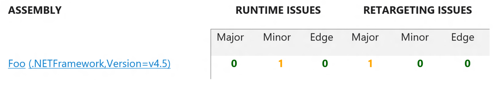

# Breaking Changes

Compatibility is a very important goal of each .NET release.  This is accomplished by ensuring each version is additive so previous 
versions will still work; however, when a change must be made to previous functionality (for performance, security, or a bug) this 
can cause compatibility problems in already written code. A distinction to understand with .NET compatibility is runtime vs retargeting 
issues.

When developing an app the .NET Framework version that the app is targeting is specified either by [specifying a target Framework 
in Visual Studio](https://msdn.microsoft.com/en-us/library/bb398202%28v=vs.140%29.aspx), [specifying the target Framework in a project 
file](https://msdn.microsoft.com/en-us/library/hh264221.aspx), or [applying a TargetFrameworkAttribute 
to the source code](https://msdn.microsoft.com/en-us/library/system.runtime.versioning.targetframeworkattribute%28v=vs.110%29.aspx).

When running on a newer version than what was targeted, the .NET Framework will 
use quirked behavior to mimic the older targeted version. In other words, the app will run on the newer version of the Framework, but act as if it's
running on the older version. Many of the breaking changes between versions of the .NET Framework are mitigated through this 
quirking model.

Runtime issues are those that arise when a new runtime is placed on a machine and the same binaries are run, but different behavior is 
seen. If a binary was compiled for .NET 4.0 it will run in .NET 4.0 compatibility mode on 4.5+. Many of the changes that affect 
4.5 will not affect a binary compiled for 4.0. This is specific to the AppDomain and depends on the settings of the entry assembly. 

Retargeting issues are those that arise when an assembly that was targeting 4.0 is now set to target 4.5. Now the assembly opts into the new features 
as well as potential breaking changes to old features. Again, this is dictated by the entry assembly, so the console app that
uses the assembly, or the website that references the assembly.

Sometimes there are new behaviors that can be toggled on or off. This is often done by registry keys or configuration values, but
depends on the specific change if those are available.

**Note** This analysis is only applicable to assemblies that are designed to run on the .NET Framework 4.0+.

## Quirks
Quirks are an important concept to understand .NET compatibility.  Quirks are special branches within the .NET Framework that preserve 
the legacy behavior and applies it where appropriate. For some features and APIs, rather than introducing a breaking change, the .NET 
Framework provides a quirks mode that preserves the legacy behavior and applies it where appropriate, depending on the target version 
the app was originally built and tested for.  If the target version is .NET Framework 4.0, quirks mode either emulates the same 
behavior, or it uses the same code when running on .NET Framework 4.5+.  In other words, the app runs in .NET Framework 4.5+ as it 
did when it was tested against .NET Framework 4.0.

The most common quirks are dependent on the framework an assembly is compiled for. This can help ensure that it will only run on later 
versions; i.e., if you compile against 4.5, you cannot add this to a 4.0 project; however, you may add it to any version greater than 
or equal to 4.5.  This is one of the simplest ways to opt into a quirk and if compiling with msbuild this is done automatically. If 
msbuild is not being used to compile the assembly then a one line global assembly attribute will add it manually.

A TFM is automatically added by msbuild projects during the compilation step. If you create a project that targets .NET Framework 4.6 
and compile, you will find a new file located at `%temp%\.NETFramework,Version=v4.6.AssemblyAttributes.cs` in which the TFM is described:

```csharp
// <autogenerated />
using System;
using System.Reflection;
[assembly: global::System.Runtime.Versioning.TargetFrameworkAttribute(".NETFramework,Version=v4.6", FrameworkDisplayName = ".NET Framework 4.6")]
```

## Known Issues
This tool does not catch all known issues of breaking changes. ApiPort is restricted to catching only breaks introduced for a specific API, 
not breaks due to patterns that may be used. To see the full list of issues, please review those listed [here](/docs/BreakingChanges). 

In addition to this tool, there is work being done on a set of Roslyn-based analyzers that will better determine 
possible breaking changes that also include specific programming patterns. These are much more targeted and will provide better information 
as to what should be done. ApiPort lets you know which issues have source analyzers available, but they are currently not released. Please 
watch for updates regarding this in the near future.

# Find Breaking Changes with ApiPort

To obtain ApiPort, download it [here](https://github.com/Microsoft/dotnet-apiport/releases). Finding breaking changes with ApiPort is done 
by running the following command:

```cmd
ApiPort.exe analyze -b -f [assembly] 
```

This can be customized by various inputs which are described by running `ApiPort.exe help`. For detailed descriptions, please see [here](/docs/HowTo/Introduction.md#analyze).

## Walkthrough

As an example of determining breaking changes, consider the following code fragment:

```csharp
using System;
using System.Threading.Tasks;

namespace Application
{
    class Program
    {
        static void Main(string[] args)
        {
            var uri = new Uri("");

            Task.WaitAll(new Task[] { }, 0);
        }
    }
}
```

This code contains two APIs that have had some breaking changes affect them: `System.Uri` and `System.Threading.Tasks.Task.WaitAll(Task[], Int32)`. 
They are not major changes, but may affect people in certain scenarios. After compiling the example code into foo.dll, we run it with ApiPort as follows:

```cmd
ApiPort.exe analyze -f foo.dll -b -r html
```

This will produce an HTML result that gives an overview of the findings.  The first thing you'll see is a summary table of the assemblies that were
scanned. This list is sorted by number of issues, categorized by runtime and retargeting issues:



Looking at this report, it is clear that there are two APIs present in the assembly that may affect its ability to move to a newer framework version. 
As discussed earlier, the most important issue to address are the runtime issues.

### Step 1: Runtime issues

Only one runtime issue was found, so we first take a look at that. It is categorized as a minor issue; however, there are ways to customize the 
reporting as the impact of a specific issue may be more serious for certain scenarios. The report shows the following information for this issue:


| Field | Value |
|:----|:----|
| ID | 26 |
| API | System.Threading.Tasks.Task.WaitAll(System.Threading.Tasks.Task[],System.Int32) |
| Details | Task.WaitAll behavior was made more consistent in .NET 4.5.<br/>  In the .NET Framework 4, these methods behaved inconsistently. When the time-out expired, if one or more tasks were completed or canceled before the method call, the method threw an AggregateException exception. When the time-out expired, if no tasks were completed or canceled before the method call, but one or more tasks entered these states after the method call, the method returned false.<br/>  In the .NET Framework 4.5, these method overloads now return false if any tasks are still running when the time-out interval expired, and they throw an AggregateException exception only if an input task was cancelled (regardless of whether it was before or after the method call) and no other tasks are still running. |
| Recommendation | If an AggregateException was being caught as a means of detecting a task that was cancelled prior to the WaitAll call being invoked, that code should instead do the same detection via the IsCanceled property (for example: .Any(t => t.IsCanceled)) since .NET 4.6 will only throw in that case if all awaited tasks are completed prior to the timeout.
| Quirked | False | 
| Version Introduced | 4.5 |
| Version Reverted | |
| Analyzer STatus| Planned |
| Link | More info |


With this information, the next step is to look at the times in which Task.WaitAll is used and verify that the old inconsistent behavior was 
not being used. Identifying those locations will also help know where targeted testing should be focused to ensure that the updated behavior 
works with the modifications.

After the issue has been addressed and tested, the runtime issues for this assembly has been addressed. Keep in mind that the number of call 
sites is not reflected in the report, just the presence of a call.

### Step 2: Retargeting Issue

*Note: This section is only needed when retargeting. If no retargeting will occur (i.e. running the same binary on .NET 4.0
and 4.6 without changing the target framework), these issues can be ignored*

The retargeting issue for this one should be addressed after the runtime issue has been addressed and when the assembly is being 
retargeted to a newer version, most likely to take advantage of new functionality. The report for this retargeting issue is a major 
issue, although, again, the severity of these changes are customizable as it is not a one-size-fit-all.

| Field | Value |
|:---|:---|
| ID | 6 |
| API | System.Uri.#ctor(System.String) |
| Details | URI parsing has changed in several ways in .NET 4.5. Note, however, that these changes only affect code targeting .NET 4.5. If a binary targets .NET 4.0, the old behavior will be observed. Changes to URI parsing in .NET 4.5 include:<br /> - URI parsing will perform normalization and character checking according to the latest IRI rules in RFC 3987<br /> - Unicode normalization form C will only be performed on the host portion of the URI<br /> - Invalid mailto: URIs will now cause an exception<br /> - Trailing dots at the end of a path segment are now preserved<br /> - file:// URIs do not escape the '?' character<br /> - Unicode control characters U+0080 through U+009F are not supported<br /> - Comma characters (',' %2c) are not automatically unescaped |
| Recommendation | If the old .NET 4.0 URI parsing semantics are necessary (they often aren't), they can be used by targeting .NET 4.0. This can be accomplished by using a TargetFrameworkAttribute on the assembly, or through Visual Studio's project system UI in the 'project properties' page.|
| Quirked | True |
| Version Introduced | 4.5 |
| Version Reverted | |
| Analyzer Status | Available |
| Link | More info |


This issue gives a list of cases wherein the changes may be manifest in an application. Since this change is most likely highly 
data-driven, a possible way to mitigate breaks with the new changes would be to find instances of `System.Uri` used in the codebase 
and track the data that may be coming into it. This data could be analyzed to see if it may break with the new changes to `System.Uri`. 
